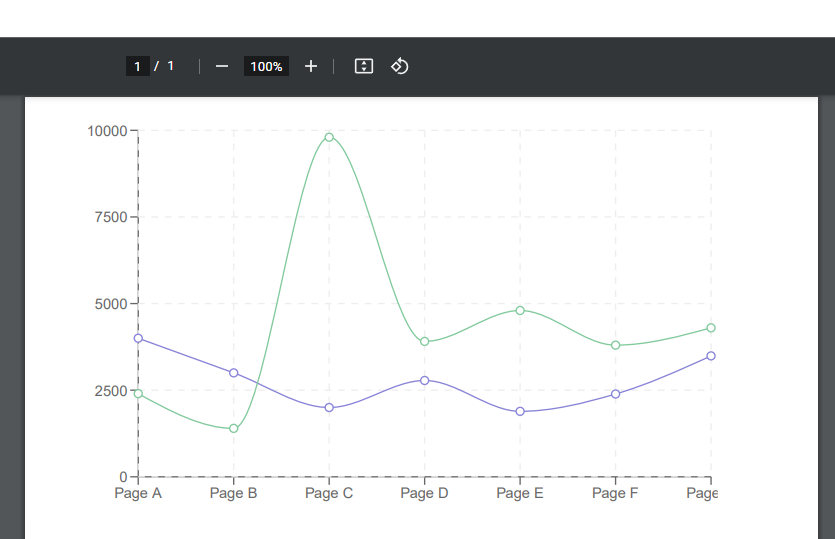

# react-pdf-charts

Allows SVG-based React charts to be rendered in react-pdf.

> **Warning**
> This library is in early development and may not be production ready. Please give it a try and provide your feedback in the issues.

## Examples

[](https://github.com/EvHaus/react-pdf-charts)

## Install

```
npm install react-pdf-charts
```

## Usage

```tsx
import ReactPDFChart from 'react-pdf-charts';

const data = [
    {
        name: 'Page A',
        uv: 4000,
        pv: 2400,
        amt: 2400,
    },
    {
        name: 'Page B',
        uv: 3000,
        pv: 1398,
        amt: 2210,
    },
    {
        name: 'Page C',
        uv: 2000,
        pv: 9800,
        amt: 2290,
    },
    {
        name: 'Page D',
        uv: 2780,
        pv: 3908,
        amt: 2000,
    },
    {
        name: 'Page E',
        uv: 1890,
        pv: 4800,
        amt: 2181,
    },
    {
        name: 'Page F',
        uv: 2390,
        pv: 3800,
        amt: 2500,
    },
    {
        name: 'Page G',
        uv: 3490,
        pv: 4300,
        amt: 2100,
    },
];

const SomeComponent = () => (
    <ReactPDFChart>
        <LineChart data={data} height={300} width={500}>
            <XAxis dataKey='name' />
            <YAxis />
            <CartesianGrid stroke='#eee' strokeDasharray='5' />
            <Line type='monotone' dataKey='uv' stroke='#8884d8' />
            <Line type='monotone' dataKey='pv' stroke='#82ca9d' />
        </LineChart>
    </ReactPDFChart>
);
```

## Examples

You can check the working examples in the `/examples` folder.

You can re-run the examples by downloading this repository, running `bun install` to install dependencies, and then running `bun start` to re-generate the `.pdf` files in the examples folder.