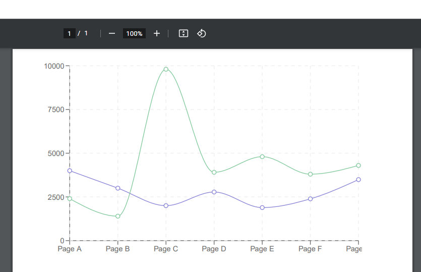

<div align="center">
<h1>react-pdf-charts 📊</h1>

<p>Allows you to use popular SVG charting libraries (like `recharts`) in your `react-pdf` PDF documents.</p>
</div>

---

[![version][version-badge]][package]
[![downloads][downloads-badge]][npmtrends]

> **Warning**
> This library is in early development and may not be production ready. Please give it a try and provide your feedback in the issues.

## The problem

One of the best ways to generate PDFs is using [`react-pdf`](https://react-pdf.org/). Unfortunately `react-pdf` has [several](https://github.com/diegomura/react-pdf/issues/1720) [major](https://github.com/diegomura/react-pdf/issues/1271) [annoying](https://github.com/diegomura/react-pdf/issues/2003) [bugs](https://github.com/diegomura/react-pdf/issues/2017) that makes rendering SVG charts very difficult. This library attempts to ease the pain and provide a possible workaround until those bugs are fixed.

## This solution

This library provides a wrapper component that allows you to use popular SVG charting libraries (like `recharts`) in your `react-pdf` PDF documents. The wrapper will convert all generated `<svg>` DOM elements into compatible [`react-pdf` SVG image elements](https://react-pdf.org/svg). The library will also attempt to workaround common bugs and limitations gracefully.

The outcome is that you'll be able to have PDF documents with beautiful charts like this:

[](https://github.com/EvHaus/react-pdf-charts)

## Table of Contents

- [Installation](#installation)
- [Usage](#usage)
  - [Props](#props)
  - [Examples](#examples)
  - [Known Issues](#known-issues)
- [Other Solutions](#other-solutions)
- [Issues](#issues)
  - [🐛 Bugs](#-bugs)
  - [💡 Feature Requests](#-feature-requests)
- [Contributors ✨](#contributors-)
- [LICENSE](#license)

## Installation

This module is distributed via [npm][npm] which is bundled with [node][node] and
should be installed as one of your project's `dependencies`:

```
npm install react-pdf-charts
```

## Usage

```tsx
import ReactPDFChart from "react-pdf-charts";

const data = [
  {
    name: "Page A",
    uv: 4000,
    pv: 2400,
    amt: 2400,
  },
  {
    name: "Page B",
    uv: 3000,
    pv: 1398,
    amt: 2210,
  },
  {
    name: "Page C",
    uv: 2000,
    pv: 9800,
    amt: 2290,
  },
  {
    name: "Page D",
    uv: 2780,
    pv: 3908,
    amt: 2000,
  },
  {
    name: "Page E",
    uv: 1890,
    pv: 4800,
    amt: 2181,
  },
  {
    name: "Page F",
    uv: 2390,
    pv: 3800,
    amt: 2500,
  },
  {
    name: "Page G",
    uv: 3490,
    pv: 4300,
    amt: 2100,
  },
];

const SomeComponent = () => (
  <ReactPDFChart>
    <LineChart data={data} height={300} width={500}>
      <XAxis dataKey="name" />
      <YAxis />
      <CartesianGrid stroke="#eee" strokeDasharray="5" />
      <Line type="monotone" dataKey="uv" stroke="#8884d8" />
      <Line type="monotone" dataKey="pv" stroke="#82ca9d" />
    </LineChart>
  </ReactPDFChart>
);
```

From there you can pass `SomeComponent` to `react-pdf` to be rendered either on the server or the client via its rendering APIs.

## Props

### debug

> `boolean` | defaults to `false`

Enables `react-pdf` [debugging mode](https://react-pdf.org/advanced#debugging) for the outer wrapper element.

### chartStyle

> `{}` | optional, some base `recharts` styles are applied by default

An optional [Stylesheet](https://react-pdf.org/styling) that maps web CSS class names to whatever `react-pdf` styles you wish to replace those classes with.

The idea is that popular SVG charting libraries (like `recharts`) will apply various classes to its elements (eg. `<span class="recharts-default-legend">...</span>`). Since class names aren't supported in `react-pdf`, this prop allows to you replace those class names with custom styling. The `react-pdf-charts` library will convert any matches class names to the corresponding `react-pdf` styles.

### style

> `{}` | optional, no default

An optional [style](https://react-pdf.org/styling) that will get applied to the outer element of the wrapper component.

### Examples

You can check the working examples in the `/examples` folder.

You can re-run the examples by downloading this repository, running `bun install` to install dependencies, and then running `bun start` to re-generate the `.pdf` files in the examples folder.

There's also `/examples/client` which is a small little web server which you can use to test `react-pdf`'s web-only APIs like `PDFViewer` and `PDFDownloadLink`. To run that example, use `cd examples/client && bun install && bun start`.

### Known Issues

- [ ] Only `recharts` and `victory` have been tested. In theory `react-pdf-charts` should work with others charting libraries (like `highcharts`) but those haven't been tested yet.
- [ ] When rendering `<Bar />` and `<Area />` charts with `recharts` using client-side rendering (ie. `<PDFViewer>` or `<PDFDownloadLink>`), it's important to set `isAnimationActive={false}` on your `<Bar />` compoments otherwise the chart will not render correctly ([more info](https://github.com/EvHaus/react-pdf-charts/issues/51#issuecomment-1712407584)). Perhaps in the future `react-pdf-charts` could auto-detect this and disable animations automatically.

## Other Solutions

There's [this great Gist by kidroca](https://gist.github.com/kidroca/19e5fe2de8e24aa92a41e94f2d41eda4) that served as inspiration for this library, but beyond that I'm not aware of any other solutions in the `react-pdf` community.

## Issues

_Looking to contribute? Look for the [Good First Issue][good-first-issue]
label._

### 🐛 Bugs

Please file an issue for bugs, missing documentation, or unexpected behavior.

[**See Bugs**][bugs]

### 💡 Feature Requests

Please file an issue to suggest new features. Vote on feature requests by adding
a 👍. This helps maintainers prioritize what to work on.

[**See Feature Requests**][enhancements]

## Contributors ✨

Thanks goes to these people:

<table>
  <tbody>
    <tr>
      <td align="center"><a href="https://haus.gg"><br /><sub><b>Ev Haus</b></sub></a></td>
    </tr>
  </tbody>
</table>

## License

MIT

[npm]: https://www.npmjs.com
[node]: https://nodejs.org
[package]: https://www.npmjs.com/package/react-pdf-charts
[npmtrends]: https://www.npmtrends.com/react-pdf-charts
[version-badge]: https://img.shields.io/npm/v/react-pdf-charts.svg?style=flat-square
[downloads-badge]: https://img.shields.io/npm/dm/react-pdf-charts.svg?style=flat-square
[bugs]: https://github.com/EvHaus/react-pdf-charts/issues?q=is%3Aopen+is%3Aissue+label%3Abug
[enhancements]: https://github.com/EvHaus/react-pdf-charts/issues?q=is%3Aopen+is%3Aissue+label%3Aenhancement
[good-first-issue]: https://github.com/EvHaus/react-pdf-charts/issues?q=is%3Aopen+is%3Aissue+label%3A%22good+first+issue%22
